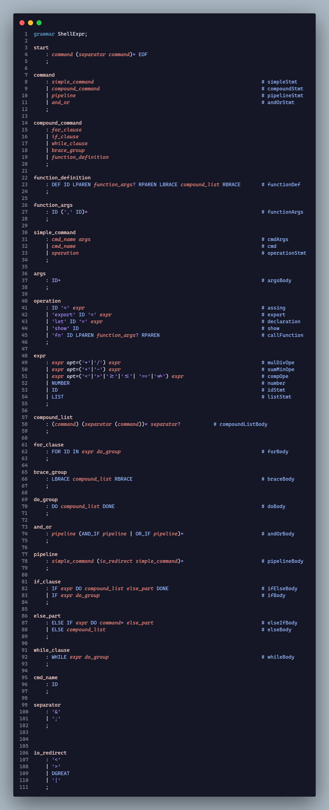
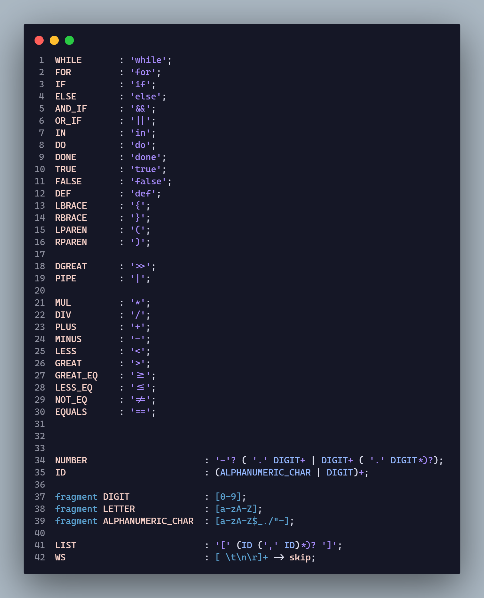
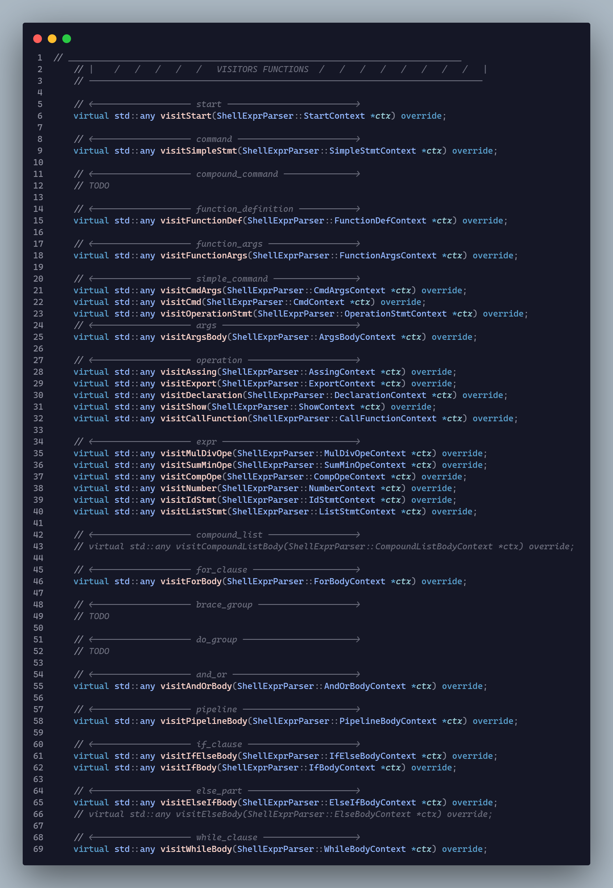
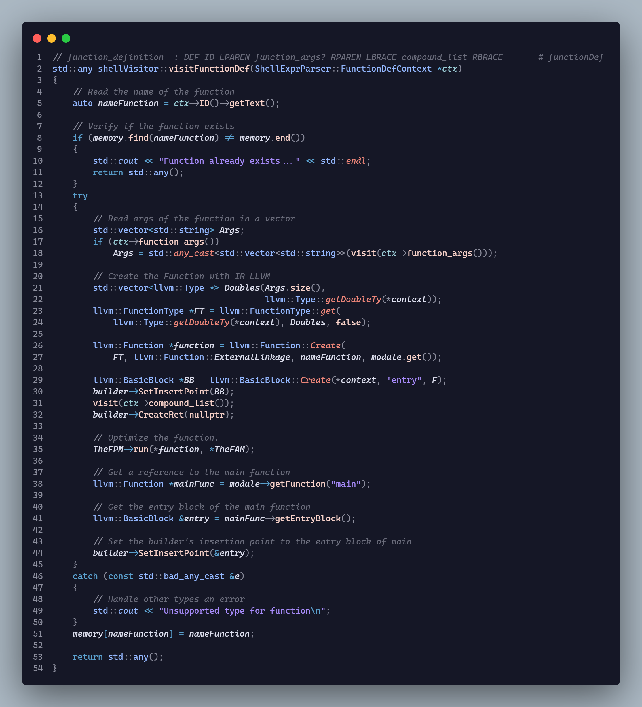
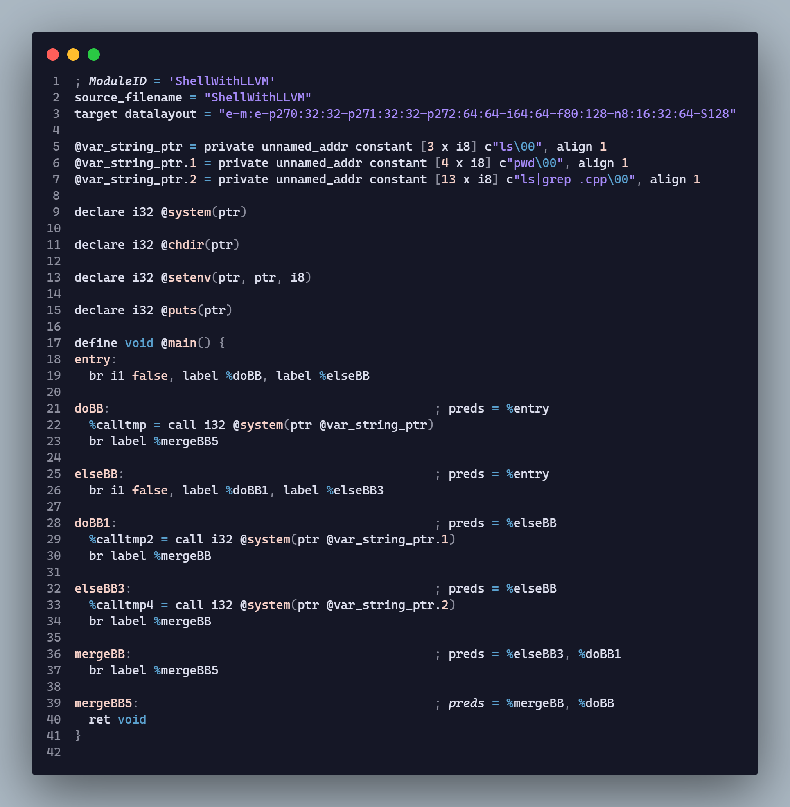
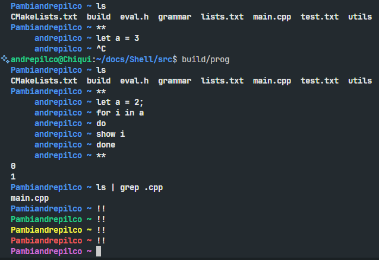

# Shell
## Índice
- [Shell](#shell)
	- [Índice](#índice)
	- [Integrantes](#integrantes)
	- [Introducción](#introducción)
	- [Objetivos](#objetivos)
	- [Analizador Léxico y Sintáctico](#analizador-léxico-y-sintáctico)
	- [Visitores en **C++**](#visitores-en-c)
	- [Generación de **IR** y optimización con **JIT**](#generación-de-ir-y-optimización-con-jit)
	- [Características Adicionales](#características-adicionales)
	- [Conclusiones](#conclusiones)
	- [Configuration](#configuration)
	- [Installation](#installation)
		- [Install Antlr](#install-antlr)
		- [Configure Antlr Runtime](#configure-antlr-runtime)
		- [Install llvm](#install-llvm)
	- [Executing Project](#executing-project)

## Integrantes
- Luis Felipe Poma Astete (u202110902)
- André Dario Pilco Chiuyare (u202110764)
- John Davids Sovero Cubillas (u202115065)

**Docente:** Luis Martin Canavals Sanchez

## Introducción
El presente proyecto corresponde al trabajo final del curso de Teoría de Compiladores, el cual planteo el desarrollo de una shell que disponga de la capacidad de scripting, tratamiento de variables de entorno, acceso a comandos de sistema, modo interactivo y dos características adicionales: autocompletado de archivos y personalización de colores. Durante este proceso, se emplean los conocimientos adquiridos durante el ciclo académico sobre analizadores léxicos, analizadores sintácticos, visitores en C++, código intermedio con LLVM y optimización con JIT.

## Objetivos
- Diseñar una Shell empleando los conocimientos adquiridos en el curso.
- Implementación de comandos básicos, tales como “cd”, “ls”, “mkdir”, “rm”, entre otros.
- Soporte para la redirección de entrada y salida.
- Ejecución de programas externos a través de la línea de comandos, asegurando una integración fluida con el entorno de la Shell.
- Implementar el analizador léxico y sintáctico en ANTLR para un análisis preciso y eficiente de las entradas proporcionadas por el usuario.
- Generación de código intermedio con LLVM y optimización de este a través de JIT
- Implementar manejo de errores de entrada informativo que mejore la experiencia de interacción.
- Desarrollar e implementar autocompletado de archivos para la mejora de la eficiencia en la interacción.
- Permitir que el usuario personalice su shell a través de colores, mejorando la estética.

## Analizador Léxico y Sintáctico
Para este apartado se ha utilizado `ANTLR4`. Para la generación de un lexer y un parser precisos, se definieron las restricciones necesarias y las funcionalidades a implementar en función de los requisitos del enunciado.

* Parser

* Lexer


## Visitores en **C++**
Para poder ejecutar funciones especificas en cada nodo del `AST` utilizamos visitores en el lenguaje de programación `C++`. Estos nos permitieron implementar un sistema de manejo de errores informativo que mejora la experiencia de interacción.



## Generación de **IR** y optimización con **JIT**
La generación de código intermedio fue realizada empleando `LLVM` interactuando con los visitores de `ANTLR4` y optimizamos utilizando `Just In Time`.





## Características Adicionales
Como valor agregado, hemos implementado dos funcionalidades adicionales para mejorar la experiencia de usuario: autocompletado de archivos y personalización de colores. La primera emplea la estructura de datos `Trie` para mejorar la complejidad algorítmica. Por otro lado, la personalización de colores se realiza a través del comando `!!`. Dichas implementaciones se encuentran en el `main.cpp`, donde también se maneja el modo multilínea o también llamado headless, el cual se activa y finaliza ingresando el comando `**`.

<div align=center>

</div>

## Conclusiones
Este proyecto nos ha permitido poner en práctica los conocimientos teóricos adquiridos durante el semestre académico y afianzar el uso de herramientas como `ANTLR4` y `LLVM`. Además, hemos hecho uso de lo aprendido en cursos anteriores para optimizar el código a través de estructuras de datos y pusimos en prioridad la experiencia de usuario al implementar funcionalidades adicionales relevantes. No obstante, los logros no solo se centran en lo académico, sino también en el desarrollo de proyectos en grupo a través de comunicación efectiva y escucha activa. Entonces, se podría considerar este trabajo como un proyecto integral multidisciplinario como prueba tangible de nuestras habilidades.


## Configuration

- `.vscode` : Configuration files (`tasks.json` and `launch.json`) for debug in vscode
- `.clangd` : Configuration file for clangd server language
- `setup.sh` : Script for create `PATHS` for llvm and antlr and activate `env`
- `requirements.txt` : File for install `antlr4` with pip
- For debugger/runner of vscode works, add this variables to your `.zshrc`, `.bashrc`, `etc`.
  ****
	```bash
	export MYDEPENDENCIES=$HOME/Apps
	export LLVMDEPENDENCIES=$HOME/llvm/llvm-project/build

	export ANTLR4HOME=$MYDEPENDENCIES/antlr4-cpp/run
	export ANTLR4I=$ANTLR4HOME/usr/local/include/antlr4-runtime
	export ANTLR4L=$ANTLR4HOME/usr/local/lib/

	export LLVM17I=$LLVMDEPENDENCIES/include
	export LLVM17L=$LLVMDEPENDENCIES/lib
	```

## Installation

### Install Antlr
 - Create a virtual enviroment
	```bash
	python -m venv /path/to/new/virtual/environment
	```
 
 - Install Antlr using pip
	```bash
	python -m pip install antlr4-tools
	```
	> or execute with the file `requirements.txt`
	```bash
	pip install -r requirements.txt
	```

 
 - Verify installation
	```bash
	antlr
	```
### Configure Antlr Runtime

1. Using CLI (Arch Linux)
	```bash
	sudo pacman -S antlr4-runtime
	```

2. Manually (Others / Debian)
	* Download `antlr4-runtime` via Curl

		```bash
		curl https://www.antlr.org/download/antlr4-cpp-runtime-4.13.1-source.zip -o antlr4-runtime.zip  
		```

	* Now install the necesary dependencies and libraries

		```bash
		sudo apt install cmake
		sudo apt install uuid-dev
		sudo apt install pkg-config 
		```

	- Now we compile and get the libraries from antlr4-runtime

		```bash
		mkdir build && mkdir run && cd build
		cmake ..
		DESTDIR=../run make install
		```

	* Now copy the ANTLR 4 include files to `/usr/local/include` and the ANTLR 4 libraries to `/usr/local/lib`

		```bash
		cd ../run/usr/local/include
		ln -s ~/Apps/antlr4-cpp/run/usr/local/include/antlr4-runtime /usr/local/include
		cd ../lib
		sudo cp * /usr/local/lib
		sudo ldconfig
		```
		> Now `antlr4-runtime` is installed
### Install llvm

- Using CLI in Arch
	```bash
	sudo pacman llvm
	```

- Using CLI in Debian
	```bash
	sudo apt-get install llvm-15 llvm-15-dev llvm-15-doc llvm-15-linker-tools llvm-15-runtime llvm-15-tools
	```

- Installing manually
	```bash
	git clone --depth 1 https://github.com/llvm/llvm-project.git
	```
	```bash
	cd llvm-project
	```
	```bash
	cmake -S llvm -B build -G "Unix Makefiles" -DCMAKE_BUILD_TYPE=Release -DCMAKE_CXX_COMPILER=clang++ -DCMAKE_C_COMPILER=clang
	```
	```bash
	cmake --build build -j4
	```
	> Install in the libraries of the system
	```bash
	cmake --install build --prefix /usr/local/include
	```

## Executing Project

- Creating the `antlr4` files for `c++`
	```bash
	antlr4 -no-listener -visitor -Dlanguage=Cpp -o libs ShellExpr.g4
	```
  	> Run this command from the folder `./src/grammar`.
	
- Compiling and running the project
	```bash
	cmake -S . -B build -DCMAKE_EXPORT_COMPILE_COMMANDS=1
	```
	> Run this command from the folder `./src`.
	```bash
	cmake --build build -j8
	```
	> Execute the binary file in `./build/`
	```bash
	build/prog
	```
	> Also you can run the project with `F5` in vscode, with the config files `task.json` and `launch.json`

> PoV siempre con Alegria.